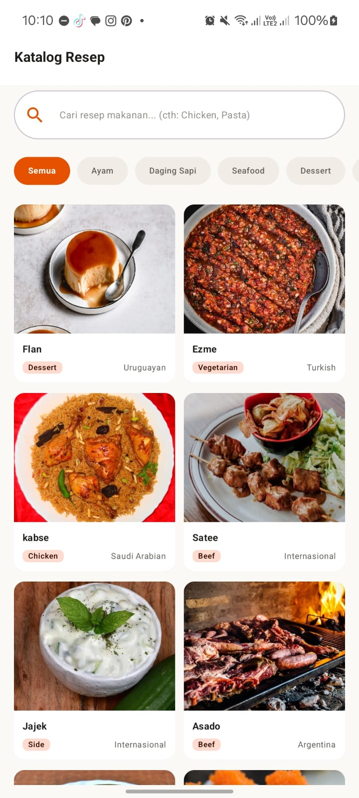
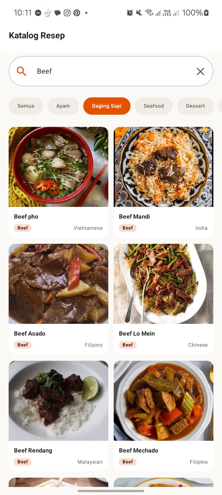
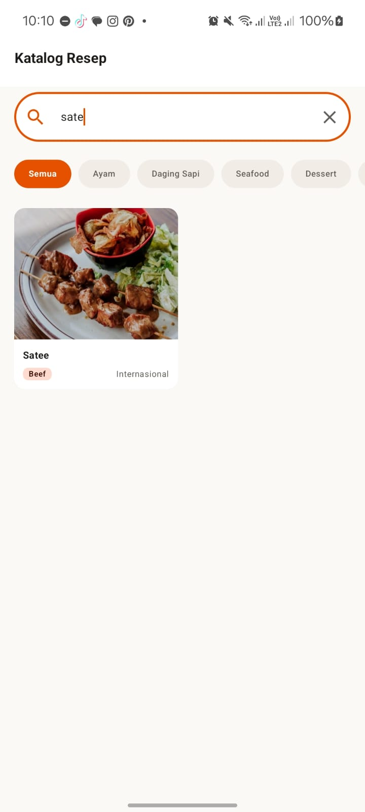
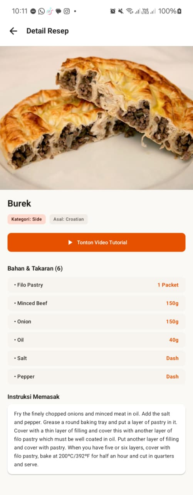

# Aplikasi Katalog dan Eksplorasi Resep Makanan
> Aplikasi pencarian dan eksplorasi resep masakan berbasis Android Jetpack Compose dan TheMealDB REST API.

---

## 👤 Identitas Praktikan
- **Nama Lengkap:** Cut Alzeena Rency Fadania
- **NIM:** H1D024037
- **Shift Awal:** Shift A
- **Shift Akhir:** Shift E
- **Link Video Demo/Penjelasan:** [YouTube](https://youtu.be/UKG8xzCV29M) | [Video Demo Lokal](Video%20Demo/VideoDemo-H1D024037.mp4)

---

## 📱 Deskripsi Aplikasi
Aplikasi **Katalog dan Eksplorasi Resep Makanan** dirancang untuk memudahkan pengguna dalam mencari, melihat, dan mengeksplorasi berbagai resep masakan dari berbagai kategori serta negara asal secara dinamis. Masalah yang diselesaikan adalah sulitnya menemukan inspirasi memasak beserta takaran bahan dan langkah memasak yang terstruktur di perangkat mobile. Aplikasi ini ditujukan bagi pecinta kuliner, ibu rumah tangga, dan siapa saja yang ingin belajar memasak secara praktis.

---

## 🛠️ Penjelasan Teknis

### 1. Spesifikasi & Tech Stack
- **Bahasa:** Kotlin 2.2.10
- **UI Framework:** Jetpack Compose (Material 3)
- **Min SDK:** 29 (Android 10.0) | **Target SDK:** 37 (Android 16)
- **Pola Arsitektur:** MVVM (Model-View-ViewModel) + Repository Pattern
- **Library Utama:**
  - `Navigation Compose` (Routing halaman Home ke Detail)
  - `ViewModel` & `StateFlow` (State Management reaktif)
  - `Retrofit 2` & `Gson Converter` (Networking / REST API TheMealDB)
  - `OkHttp Logging Interceptor` (Monitoring request & response jaringan)
  - `Coil Compose` (Asynchronous Image Loading)
  - `Kotlin Coroutines` (Pemrosesan asinkron & debouncing pencarian)

### 2. Fitur Utama
- **Katalog Resep (LazyVerticalGrid):** Menampilkan kumpulan resep masakan dari API ke dalam tata letak grid 2-kolom yang dinamis dan responsif dengan kartu resep (`RecipeCard`).
- **Pencarian & Filter Kategori:** Fitur pencarian resep real-time berbasis nama masakan dengan *debouncing* coroutine 400ms serta tombol filter kategori cepat (`CategoryChipGroup`).
- **Detail Resep & Video Tutorial:** Menyajikan informasi komprehensif berupa foto makanan resolusi tinggi, asal negara, bahan dan takaran yang diekstrak dari API, instruksi langkah memasak, serta tombol intent ke video tutorial YouTube.
- **State-Driven UI & Feedback:** Menangani secara otomatis perubahan status `Loading` (indikator berputar), `Success` (data resep), `Empty` (resep tidak ditemukan), dan `Error` (pesan kegagalan koneksi dengan tombol coba lagi).

### 3. Struktur Direktori Proyek
```text
app/src/main/java/com/example/responsi_pemmob_h1d024037/
├── data/
│   ├── model/      # Data class (MealResponse, MealDto, Meal, Ingredient)
│   ├── remote/     # Endpoint API (MealApiService) dan RetrofitInstance
│   └── repository/ # MealRepository (Jembatan antara ViewModel & API)
├── ui/
│   ├── components/ # Reusable UI (RecipeCard, SearchBar, Chips, States)
│   ├── navigation/ # AppNavGraph (NavHost dan Rute Halaman)
│   ├── screens/    # HomeScreen (Katalog & Search) & DetailScreen
│   ├── theme/      # Color, Type, Theme Material 3
│   └── viewmodel/  # RecipeViewModel & UiStates (Manajemen state dan logika bisnis)
└── MainActivity.kt # Entry point dari aplikasi
```

---

## 📸 Tangkapan Layar (Screenshots)

| Home Screen (Katalog) | Pencarian (Search) | Detail Screen (Bahan) | Detail Screen (Instruksi) |
|:---:|:---:|:---:|:---:|
|  |  |  |  |

---

## 🚀 Cara Menjalankan Proyek

1. **Prasyarat:**
   - Android Studio (Ladybug / Meerkat / versi terbaru disarankan).
   - JDK 17 atau lebih baru (mendukung JDK 21).
   - Perangkat fisik Android (API 29+) dengan USB Debugging aktif atau Emulator.
   - Koneksi internet aktif untuk sinkronisasi Gradle dan fetching REST API TheMealDB.

2. **Langkah:**
   ```bash
   # Clone repository
   git clone https://github.com/alzeecyy/Responsi1_PemogramanMobile_Resep_H1D024037.git
   ```
3. Buka folder proyek di **Android Studio**.
4. Tunggu proses **Gradle Sync** selesai.
5. Pilih target perangkat/emulator, lalu klik tombol **Run (`Shift + F10`)**.
